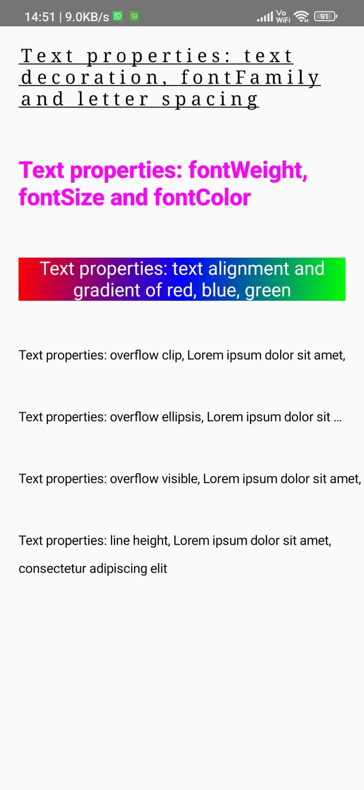

# JetPack Compose Tutorial - Day 7

## App Lifecycle

The life cycle of an app entails opening the app, performing a task, and killing the app. It is also called the activity lifecycle. The lifecycle methods are:

- `onCreate`: Called when the app is first launched. One-time setup is written inside this function.
- `onStart`: Called when the activity is visible to the user.
- `onResume`: Called when the user is interacting with the activity.
- `onPause`: Called when the user is about to leave the activity. For example, when we get a notification from another app and we click on the notification.
- `onStop`: Called when the system puts the activity in the background, and another activity is about to start.
- `onDestroy`: Called to kill the activity.

### Screenshot of Assignment

