### greetings from smruti

```markdown
package com.example.myapplication

import android.os.Bundle
import androidx.activity.ComponentActivity
import androidx.activity.compose.setContent
import androidx.compose.foundation.layout.fillMaxSize
import androidx.compose.material3.MaterialTheme
import androidx.compose.material3.Surface
import androidx.compose.material3.Text
import androidx.compose.runtime.Composable
import androidx.compose.ui.Modifier
import androidx.compose.ui.tooling.preview.Preview
import com.example.myapplication.ui.theme.MyApplicationTheme

class MainActivity : ComponentActivity() {
    override fun onCreate(savedInstanceState: Bundle?) {
        super.onCreate(savedInstanceState)
        setContent {
            MyApplicationTheme {
                // A surface container using the 'background' color from the theme
                Surface(
                    modifier = Modifier.fillMaxSize(),
                    color = MaterialTheme.colorScheme.background
                ) {
                    Greeting("Smruti")
                }
            }
        }
    }
}

@Composable
fun Greeting(name: String, modifier: Modifier = Modifier) {
    Text(
        text = "Greetings from $name :)",
        modifier = modifier
    )
}

@Preview(showBackground = true)
@Composable
fun GreetingPreview() {
    MyApplicationTheme {
        Greeting("Android")
    }
}
```

### Output


### App lifecycle

```markdown
package com.example.myapplication

import android.os.Bundle
import android.util.Log
import androidx.activity.ComponentActivity
import androidx.activity.compose.setContent
import androidx.compose.foundation.layout.fillMaxSize
import androidx.compose.material3.MaterialTheme
import androidx.compose.material3.Surface
import androidx.compose.material3.Text
import androidx.compose.runtime.Composable
import androidx.compose.ui.Modifier
import androidx.compose.ui.tooling.preview.Preview
import androidx.lifecycle.ViewModel
import androidx.lifecycle.ViewModelProvider
import com.example.myapplication.ui.theme.MyApplicationTheme

class MainActivity : ComponentActivity() {
    override fun onCreate(savedInstanceState: Bundle?) {
        super.onCreate(savedInstanceState)
        Log.d("MainActivity", "onCreate called")
        setContent {
            MyApplicationTheme {
                // A surface container using the 'background' color from the theme
                Surface(
                    modifier = Modifier.fillMaxSize(),
                    color = MaterialTheme.colorScheme.background
                ) {
                    Greeting("Smruti")
                }
            }
        }
    }

    override fun onStart() {
        super.onStart()
        Log.d("MainActivity", "onStart called")
    }

    override fun onResume() {
        super.onResume()
        Log.d("MainActivity", "onResume called")
    }

    override fun onPause() {
        super.onPause()
        Log.d("MainActivity", "onPause called")
    }

    override fun onStop() {
        super.onStop()
        Log.d("MainActivity", "onStop called")
    }

    override fun onDestroy() {
        super.onDestroy()
        Log.d("MainActivity", "onDestroy called")
    }
}

@Composable
fun Greeting(name: String, modifier: Modifier = Modifier) {
    Text(
        text = "Greetings from $name :)",
        modifier = modifier
    )
}

@Preview(showBackground = true)
@Composable
fun GreetingPreview() {
    MyApplicationTheme {
        Greeting("Android")
    }
}
```

### Output

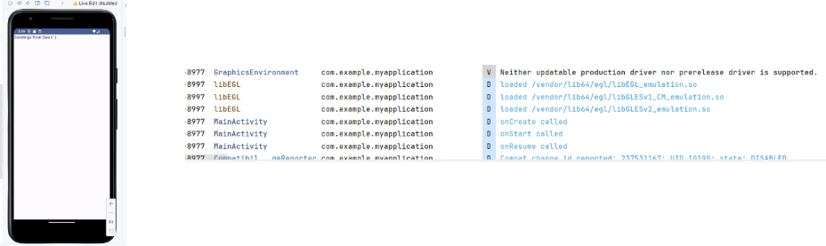
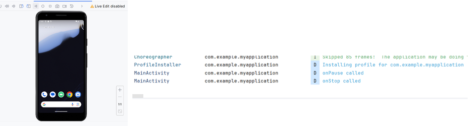
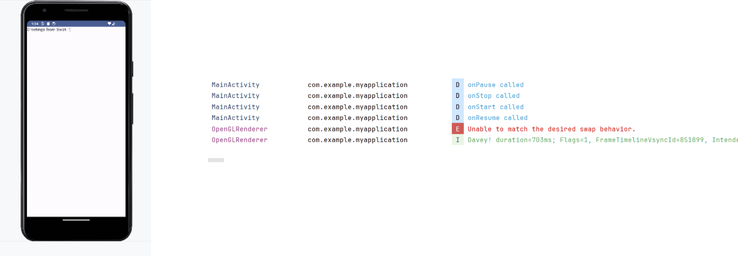
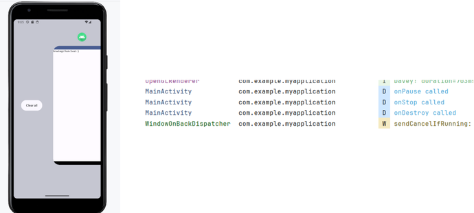

### Text modifiers

```markdown
package com.example.myapplication

import android.os.Bundle
import android.util.Size
import androidx.activity.ComponentActivity
import androidx.activity.compose.setContent
import androidx.compose.foundation.background
import androidx.compose.foundation.border
import androidx.compose.foundation.clickable
import androidx.compose.foundation.layout.*
import androidx.compose.material3.MaterialTheme
import androidx.compose.material3.Surface
import androidx.compose.material3.Text
import androidx.compose.runtime.Composable
import androidx.compose.ui.Modifier
import androidx.compose.ui.draw.drawBehind
import androidx.compose.ui.draw.rotate
import androidx.compose.ui.draw.shadow
import androidx.compose.ui.graphics.*
import androidx.compose.ui.text.TextStyle
import androidx.compose.ui.text.font.FontWeight
import androidx.compose.ui.text.style.TextDecoration
import androidx.compose.ui.tooling.preview.Preview
import androidx.compose.ui.unit.dp
import androidx.compose.ui.unit.sp
import androidx.compose.ui.zIndex
import androidx.compose.ui.graphics.Color
import androidx.compose.ui.graphics.Brush

class MainActivity : ComponentActivity() {
    override fun onCreate(savedInstanceState: Bundle?) {
        super.onCreate(savedInstanceState)
        setContent {
            MyApplicationTheme {
                // A surface container using the 'background' color from the theme
                Surface(
                    modifier = Modifier.fillMaxSize(),
                    color = MaterialTheme.colorScheme.background
                ) {
                    TextWithModifiers()
                }
            }
        }
    }
}

@Composable
fun TextWithModifiers() {
    Box(
        modifier = Modifier
            .fillMaxWidth()
            .padding(16.dp)
    ) {
        Column {
            Text(
                text = "Bold Text",
                modifier = Modifier
                    .padding(8.dp),
                style = TextStyle(fontWeight = FontWeight.Bold)
            )
            Text(
                text = "Italic Text",
                modifier = Modifier
                    .padding(8.dp),
                style = TextStyle(fontStyle = androidx.compose.ui.text.font.FontStyle.Italic)
            )
            Text(
                text = "Underlined Text",
                modifier = Modifier
                    .padding(8.dp),
                style = TextStyle(textDecoration = TextDecoration.Underline)
            )
            Spacer(modifier = Modifier.height(8.dp))
            Text(
                text = "Font Size 24sp",
                modifier = Modifier
                    .padding(8.dp),
                style = TextStyle(fontSize = 24.sp)
            )
            Spacer(modifier = Modifier.height(8.dp))
            Text(
                text = "Text with Gradient",
                modifier = Modifier
                ,style = TextStyle(
                    fontSize = 24.sp,
                        brush = Brush.horizontalGradient(
                            colors = listOf(Color.Cyan, Color.Red,Color.Blue)
                        )
                    )
            )
            Spacer(modifier = Modifier.height(8.dp))
            Text(
                text = "Text with Padding",
                modifier = Modifier
                    .padding(all = 8.dp)
            )
            Spacer(modifier = Modifier.height(8.dp))
            Text(
                text = "Text with Background",
                modifier = Modifier
                    .background(color = Color.Gray)
                    .padding(8.dp)
            )
            Spacer(modifier = Modifier.height(8.dp))
            Text(
                text = "Text with Clickable",
                modifier = Modifier
                    .clickable { /* Handle click */ }
                    .padding(8.dp)
            )
            Spacer(modifier = Modifier.height(8.dp))
            Text(
                text = "Text with Fill Max Width",
                modifier = Modifier
                    .fillMaxWidth()
                    .padding(8.dp)
            )
            Spacer(modifier = Modifier.height(8.dp))
            Text(
                text = "Text with Size",
                modifier = Modifier
                    .size(width = 100.dp, height = 50.dp)
                    .padding(8.dp)
            )
            Spacer(modifier = Modifier.height(8.dp))
            Text(
                text = "Text with Border",
                modifier = Modifier
                    .border(width = 1.dp, color = Color.Black)
                    .padding(8.dp)
            )
            Spacer(modifier = Modifier.height(28.dp))
            Text(
                text = "Text with Rotate",
                modifier = Modifier
                    .rotate(45f)
                    .padding(8.dp)
            )
            Spacer(modifier = Modifier.height(28.dp))
            Text(
                text = "Text with ZIndex",
                modifier = Modifier
                    .zIndex(1f)
                    .padding(8.dp)
            )
            Spacer(modifier = Modifier.height(8.dp))
            Text(
                text = "Text with Shadow",
                modifier = Modifier
                    .shadow(elevation = 4.dp)
                    .padding(8.dp)
            )
        }
    }
}

@Composable
fun MyApplicationTheme(
    content: @Composable () -> Unit
) {
    MaterialTheme(
        colorScheme = MaterialTheme.colorScheme,
        typography = MaterialTheme.typography,
        content = content
    )
}

@Preview(showBackground = true)
@Composable
fun DefaultPreview() {
    MyApplicationTheme {
        Surface(
            modifier = Modifier
                .fillMaxSize(),
            color = MaterialTheme.colorScheme.background
        ) {
            // Your composable content here
        }
    }
}

```


### Layouts

```markdown
package com.example.myapplication

import android.os.Bundle
import androidx.activity.ComponentActivity
import androidx.activity.compose.setContent
import androidx.compose.foundation.border
import androidx.compose.foundation.layout.*
import androidx.compose.foundation.shape.RoundedCornerShape
import androidx.compose.material3.*
import androidx.compose.runtime.Composable
import androidx.compose.ui.Alignment
import androidx.compose.ui.Modifier
import androidx.compose.ui.graphics.Brush
import androidx.compose.ui.graphics.Color
import androidx.compose.ui.text.font.FontWeight
import androidx.compose.ui.tooling.preview.Preview
import androidx.compose.ui.unit.dp
import androidx.compose.ui.unit.sp
import com.example.myapplication.ui.theme.MyApplicationTheme

class MainActivity : ComponentActivity() {
    override fun onCreate(savedInstanceState: Bundle?) {
        super.onCreate(savedInstanceState)
        setContent {
            MyApplicationTheme {
                // A surface container using the 'background' color from the theme
                Surface(
                    modifier = Modifier.fillMaxSize(),
                    color = MaterialTheme.colorScheme.background
                ) {
                    MainContent()
                }
            }
        }
    }
}

@Composable
fun MainContent() {
    Column(
        modifier = Modifier.fillMaxSize(),
        verticalArrangement = Arrangement.SpaceEvenly,
        horizontalAlignment = Alignment.CenterHorizontally
    ) {
        BasicLayout()
        BoxLayout()
        CustomLayout()
    }
}

@Composable
fun BasicLayout() {
    val topBorder = 2.dp
    val bottomBorder = 2.dp
    val topColor = Color.Blue
    val bottomColor = Color.Red

    Row(
        modifier = Modifier
            .fillMaxWidth()
            .padding(16.dp)
            .border(
                width = topBorder,
                color = topColor,
                shape = RoundedCornerShape(8.dp)
            ),
        horizontalArrangement = Arrangement.SpaceEvenly,
        verticalAlignment = Alignment.CenterVertically
    ) {
        Text(
            text = "Text 1",
            fontSize = 18.sp,
            fontWeight = FontWeight.Bold
        )
        Text(
            text = "Text 2",
            fontSize = 18.sp,
            fontWeight = FontWeight.Bold
        )
    }
}

@Composable
fun BoxLayout() {
    val leftBorder = 2.dp
    val rightBorder = 2.dp
    val leftColor = Color.Green
    val rightColor = Color.Yellow

    Box(
        modifier = Modifier
            .fillMaxWidth()
            .padding(16.dp)
            .border(
                width = leftBorder,
                color = leftColor,
                shape = RoundedCornerShape(8.dp)
            ),
        contentAlignment = Alignment.Center
    ) {
        Row(
            horizontalArrangement = Arrangement.SpaceEvenly,
            verticalAlignment = Alignment.CenterVertically
        ) {
            Text(
                text = "Text 1",
                fontSize = 18.sp,
                fontWeight = FontWeight.Bold
            )
            Text(
                text = "Text 2",
                fontSize = 18.sp,
                fontWeight = FontWeight.Bold
            )
        }
    }
}

@Composable
fun CustomLayout() {
    val borderWidth = 4.dp
    val rainbowColorsBrush = Brush.sweepGradient(listOf(Color(0xFF9575CD), Color(0xFFBA68C8), Color(0xFFE57373), Color(0xFFFFB74D), Color(0xFFFFF176), Color(0xFFAED581), Color(0xFF4DD0E1), Color(0xFF9575CD)))

    Column(
        modifier = Modifier
            .fillMaxWidth()
            .padding(16.dp)
            .border(
                width = borderWidth,
                brush = rainbowColorsBrush,
                shape = RoundedCornerShape(8.dp)
            ),
        verticalArrangement = Arrangement.spacedBy(8.dp),
        horizontalAlignment = Alignment.CenterHorizontally
    ) {
        Text(
            text = "Text 1",
            fontSize = 18.sp,
            fontWeight = FontWeight.Bold,
            modifier = Modifier.fillMaxWidth()
        )
        Text(
            text = "Text 2",
            fontSize = 18.sp,
            fontWeight = FontWeight.Bold,
            modifier = Modifier.fillMaxWidth()
        )
    }
}

@Preview(showBackground = true)
@Composable
fun MainContentPreview() {
    MyApplicationTheme {
        MainContent()
    }
}

```
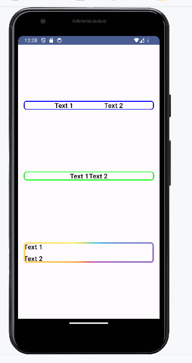

### Buttons

```markdown
package com.example.myapplication

import android.os.Bundle
import androidx.activity.ComponentActivity
import androidx.activity.compose.setContent
import androidx.compose.foundation.layout.*
import androidx.compose.material3.*
import androidx.compose.runtime.Composable
import androidx.compose.ui.Alignment
import androidx.compose.ui.Modifier
import androidx.compose.ui.tooling.preview.Preview
import com.example.myapplication.ui.theme.MyApplicationTheme

class MainActivity : ComponentActivity() {
    override fun onCreate(savedInstanceState: Bundle?) {
        super.onCreate(savedInstanceState)
        setContent {
            MyApplicationTheme {
                // A surface container using the 'background' color from the theme
                Surface(
                    modifier = Modifier.fillMaxSize(),
                    color = MaterialTheme.colorScheme.background
                ) {
                    MainContent()
                }
            }
        }
    }
}

@Composable
fun MainContent() {
    Column(
        modifier = Modifier.fillMaxSize(),
        verticalArrangement = Arrangement.SpaceEvenly,
        horizontalAlignment = Alignment.CenterHorizontally
    ) {
        BasicButton()
        ElevatedButton()
        OutlinedButton()
        TextButton()
        FilledButton()
    }
}

@Composable
fun BasicButton() {
    Button(onClick = { /* Handle button click */ }) {
        Text("Basic Button")
    }
}

@Composable
fun ElevatedButton() {
    ElevatedButton(onClick = { /* Handle button click */ }) {
        Text("Elevated Button")
    }
}

@Composable
fun OutlinedButton() {
    OutlinedButton(onClick = { /* Handle button click */ }) {
        Text("Outlined Button")
    }
}

@Composable
fun TextButton() {
    TextButton(onClick = { /* Handle button click */ }) {
        Text("Text Button")
    }
}

@Composable
fun FilledButton() {
    Button(onClick = { /* Handle button click */ }) {
        Text("Filled Button")
    }
}

@Preview(showBackground = true)
@Composable
fun MainContentPreview() {
    MyApplicationTheme {
        MainContent()
    }
}

```
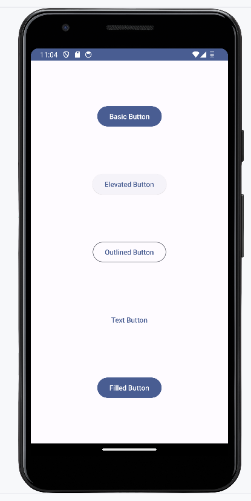

### Dialog

```markdown
package com.example.myapplication

import android.os.Bundle
import androidx.activity.ComponentActivity
import androidx.activity.compose.setContent
import androidx.compose.foundation.layout.*
import androidx.compose.material3.*
import androidx.compose.runtime.*
import androidx.compose.ui.Alignment
import androidx.compose.ui.Modifier
import androidx.compose.ui.tooling.preview.Preview
import androidx.compose.ui.unit.dp
import androidx.compose.ui.window.Dialog
import com.example.myapplication.ui.theme.MyApplicationTheme

class MainActivity : ComponentActivity() {
    override fun onCreate(savedInstanceState: Bundle?) {
        super.onCreate(savedInstanceState)
        setContent {
            MyApplicationTheme {
                // A surface container using the 'background' color from the theme
                Surface(
                    modifier = Modifier.fillMaxSize(),
                    color = MaterialTheme.colorScheme.background
                ) {
                    MainContent()
                }
            }
        }
    }
}

@Composable
fun MainContent() {
    var showDialog by remember { mutableStateOf(false) }

    Column(
        modifier = Modifier.fillMaxSize(),
        verticalArrangement = Arrangement.SpaceEvenly,
        horizontalAlignment = Alignment.CenterHorizontally
    ) {
        Button(onClick = { showDialog = true }) {
            Text("Show Dialog")
        }

        if (showDialog) {
            Dialog(
                onDismissRequest = { showDialog = false },
                content = {
                    Surface(
                        modifier = Modifier.padding(16.dp),
                        shape = MaterialTheme.shapes.medium,
                        color = MaterialTheme.colorScheme.surface
                    ) {
                        Column(
                            modifier = Modifier.padding(16.dp),
                            verticalArrangement = Arrangement.Center,
                            horizontalAlignment = Alignment.CenterHorizontally
                        ) {
                            Text("This is a dialog")
                            Spacer(modifier = Modifier.height(16.dp))
                            Button(onClick = { showDialog = false }) {
                                Text("Close")
                            }
                        }
                    }
                }
            )
        }
    }
}

@Preview(showBackground = true)
@Composable
fun MainContentPreview() {
    MyApplicationTheme {
        MainContent()
    }
}
```

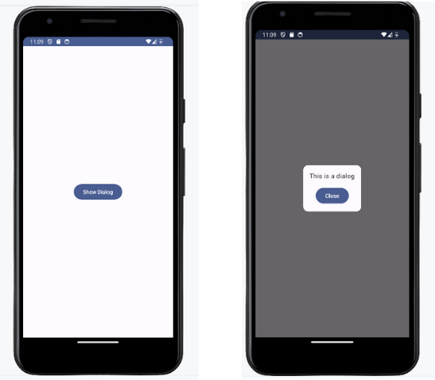

### Scaffold

```kotlin
//MainActivity.kt

package com.example.myapplication

import android.os.Bundle
import androidx.activity.ComponentActivity
import androidx.activity.compose.setContent
import androidx.compose.foundation.layout.Arrangement
import androidx.compose.foundation.layout.Column
import androidx.compose.foundation.layout.fillMaxSize
import androidx.compose.foundation.layout.fillMaxWidth
import androidx.compose.foundation.layout.padding
import androidx.compose.material.icons.Icons
import androidx.compose.material.icons.filled.Add
import androidx.compose.material3.BottomAppBar
import androidx.compose.material3.ExperimentalMaterial3Api
import androidx.compose.material3.FloatingActionButton
import androidx.compose.material3.Icon
import androidx.compose.material3.MaterialTheme
import androidx.compose.material3.Scaffold
import androidx.compose.material3.Surface
import androidx.compose.material3.Text
import androidx.compose.material3.TopAppBar
import androidx.compose.material3.TopAppBarDefaults.topAppBarColors
import androidx.compose.runtime.Composable
import androidx.compose.runtime.getValue
import androidx.compose.runtime.mutableIntStateOf
import androidx.compose.runtime.remember
import androidx.compose.runtime.setValue
import androidx.compose.ui.Modifier
import androidx.compose.ui.text.style.TextAlign
import androidx.compose.ui.tooling.preview.Preview
import androidx.compose.ui.unit.dp
import com.example.myapplication.ui.theme.MyApplicationTheme

class MainActivity : ComponentActivity() {
    override fun onCreate(savedInstanceState: Bundle?) {
        super.onCreate(savedInstanceState)
        setContent {
            MyApplicationTheme {
                Surface(
                    modifier = Modifier.fillMaxSize(),
                    color = MaterialTheme.colorScheme.background
                ) {
                    MainContent()
                }
            }
        }
    }
}

@OptIn(ExperimentalMaterial3Api::class)
@Composable
private fun ScaffoldExample() {
    var tasksCompleted by remember { mutableIntStateOf(0) }

    Scaffold(
        topBar = {
            TopAppBar(
                colors = topAppBarColors(
                    containerColor = MaterialTheme.colorScheme.primaryContainer,
                    titleContentColor = MaterialTheme.colorScheme.primary,
                ),
                title = {
                    Text(
                        text = "My Productivity App",
                        style = MaterialTheme.typography.titleLarge,
                        color = MaterialTheme.colorScheme.primary,
                    )
                }
            )
        },
        bottomBar = {
            BottomAppBar(
                containerColor = MaterialTheme.colorScheme.primaryContainer,
                contentColor = MaterialTheme.colorScheme.primary,
            ) {
                Text(
                    modifier = Modifier.fillMaxWidth(),
                    textAlign = TextAlign.Center,
                    text = "Stay focused, stay productive!",
                    style = MaterialTheme.typography.bodyLarge,
                )
            }
        },
        floatingActionButton = {
            FloatingActionButton(
                onClick = { tasksCompleted++ },
                containerColor = MaterialTheme.colorScheme.primary
            ) {
                Icon(
                    Icons.Filled.Add,
                    contentDescription = "Add Task",
                    tint = MaterialTheme.colorScheme.onPrimary,
                )
            }
        }
    ) { innerPadding ->
        Column(
            modifier = Modifier
                .padding(innerPadding)
                .padding(16.dp),
            verticalArrangement = Arrangement.spacedBy(16.dp),
        ) {
            Text(
                text = """
                    Welcome to My Productivity App!

                    Use the top app bar to navigate through different sections of the app.

                    The bottom app bar keeps you motivated with encouraging messages.

                    Press the floating action button to add a new task. Stay on top of your tasks and achieve your goals!

                    You have completed $tasksCompleted tasks today.
                """.trimIndent(),
                style = MaterialTheme.typography.bodyLarge,
            )
        }
    }
}

@Preview(showBackground = true)
@Composable
fun MainContentPreview() {
    MyApplicationTheme {
        MainContent()
    }
}

@Composable
fun MainContent() {
    ScaffoldExample()
}

```

```kotlin
// Theme.kt

package com.example.myapplication.ui.theme

import androidx.compose.material3.*
import androidx.compose.runtime.Composable
import androidx.compose.ui.graphics.Color

private val LightGreenColorScheme = lightColorScheme(
    primary = Color(0xFF4CAF50),
    onPrimary = Color.White,
    primaryContainer = Color(0xFFC8E6C9),
    onPrimaryContainer = Color.Black,
    secondary = Color(0xFF8BC34A),
    onSecondary = Color.White,
    background = Color(0xFFF1F8E9),
    onBackground = Color.Black,
    surface = Color(0xFFFFFFFF),
    onSurface = Color.Black,
)

@Composable
fun MyApplicationTheme(content: @Composable () -> Unit) {
    MaterialTheme(
        colorScheme = LightGreenColorScheme,
        typography = Typography,
        content = content
    )
}

```

### Output
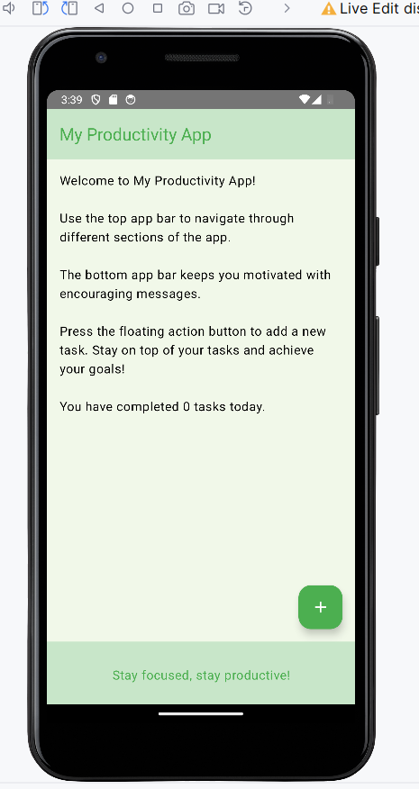

### Bottomsheet

```kotlin
package com.example.myapplication

import android.os.Bundle
import androidx.activity.ComponentActivity
import androidx.activity.compose.setContent
import androidx.compose.foundation.layout.Box
import androidx.compose.foundation.layout.fillMaxSize
import androidx.compose.foundation.layout.fillMaxWidth
import androidx.compose.foundation.layout.height
import androidx.compose.foundation.layout.padding
import androidx.compose.material.icons.Icons
import androidx.compose.material.icons.filled.Add
import androidx.compose.material3.Button
import androidx.compose.material3.ExperimentalMaterial3Api
import androidx.compose.material3.ExtendedFloatingActionButton
import androidx.compose.material3.Icon
import androidx.compose.material3.MaterialTheme
import androidx.compose.material3.ModalBottomSheet
import androidx.compose.material3.Scaffold
import androidx.compose.material3.Surface
import androidx.compose.material3.Text
import androidx.compose.material3.rememberModalBottomSheetState
import androidx.compose.runtime.Composable
import androidx.compose.runtime.getValue
import androidx.compose.runtime.mutableStateOf
import androidx.compose.runtime.remember
import androidx.compose.runtime.rememberCoroutineScope
import androidx.compose.runtime.setValue
import androidx.compose.ui.Alignment
import androidx.compose.ui.Modifier
import androidx.compose.ui.platform.LocalConfiguration
import androidx.compose.ui.unit.dp
import com.example.myapplication.ui.theme.MyApplicationTheme
import kotlinx.coroutines.launch

class MainActivity : ComponentActivity() {
    override fun onCreate(savedInstanceState: Bundle?) {
        super.onCreate(savedInstanceState)
        setContent {
            MyApplicationTheme {
                Surface(
                    modifier = Modifier.fillMaxSize(),
                    color = MaterialTheme.colorScheme.background
                ) {
                    MainContent()
                }
            }
        }
    }
}

@OptIn(ExperimentalMaterial3Api::class)
@Composable
fun MainContent() {
    val sheetState = rememberModalBottomSheetState()
    val scope = rememberCoroutineScope()
    var showBottomSheet by remember { mutableStateOf(false) }

    val screenHeight = LocalConfiguration.current.screenHeightDp.dp
    val bottomSheetHeight = screenHeight * 0.5f

    Scaffold(
        floatingActionButton = {
            ExtendedFloatingActionButton(
                text = { Text("Show bottom sheet") },
                icon = { Icon(Icons.Filled.Add, contentDescription = "") },
                onClick = {
                    showBottomSheet = true
                }
            )
        }
    ) { contentPadding ->
        Box(
            modifier = Modifier
                .fillMaxSize()
                .padding(contentPadding),
            contentAlignment = Alignment.Center
        ) {
            // Screen content
        }

        if (showBottomSheet) {
            ModalBottomSheet(
                onDismissRequest = {
                    showBottomSheet = false
                },
                sheetState = sheetState
            ) {
                Box(
                    modifier = Modifier
                        .fillMaxWidth()
                        .height(bottomSheetHeight) // Set the height of the bottom sheet content
                        .padding(16.dp),
                    contentAlignment = Alignment.Center
                ) {
                    Button(onClick = {
                        scope.launch { sheetState.hide() }.invokeOnCompletion {
                            if (!sheetState.isVisible) {
                                showBottomSheet = false
                            }
                        }
                    }) {
                        Text("Hide bottom sheet")
                    }
                }
            }
        }
    }
}
```

### Output
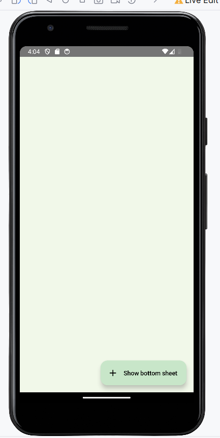
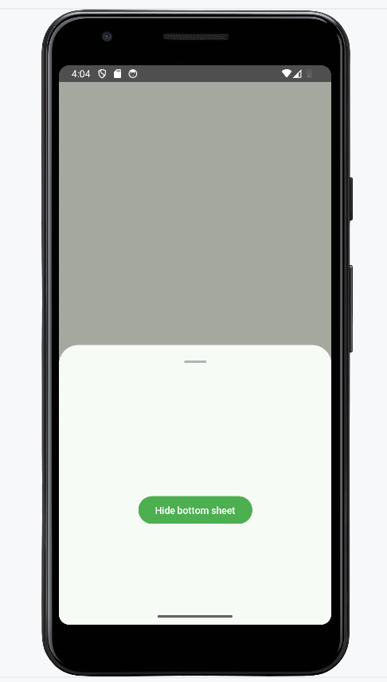

### Switch - dark theme , light theme toggle

```kotlin
//MainActivity.kt

package com.example.myapplication

import android.os.Bundle
import androidx.activity.ComponentActivity
import androidx.activity.compose.setContent
import androidx.compose.foundation.layout.*
import androidx.compose.material.icons.Icons
import androidx.compose.material.icons.filled.Add
import androidx.compose.material.icons.filled.Check
import androidx.compose.material3.*
import androidx.compose.runtime.*
import androidx.compose.ui.Modifier
import androidx.compose.ui.unit.dp
import com.example.myapplication.ui.theme.MyApplicationTheme
import androidx.compose.ui.Alignment

class MainActivity : ComponentActivity() {
    override fun onCreate(savedInstanceState: Bundle?) {
        super.onCreate(savedInstanceState)
        setContent {
            var isDarkTheme by remember { mutableStateOf(false) }

            MyApplicationTheme(darkTheme = isDarkTheme) {
                Surface(
                    modifier = Modifier.fillMaxSize(),
                    color = MaterialTheme.colorScheme.background
                ) {
                    Column(
                        horizontalAlignment = Alignment.CenterHorizontally,
                        verticalArrangement = Arrangement.Center,
                        modifier = Modifier.fillMaxSize()
                    ) {
                        Text(text = if (isDarkTheme) "Dark Theme" else "Light Theme")
                        Switch(
                            checked = isDarkTheme,
                            onCheckedChange = { isDarkTheme = it },
                            thumbContent = if (isDarkTheme) {
                                {
                                    Icon(
                                        imageVector = Icons.Filled.Check,
                                        contentDescription = null,
                                        modifier = Modifier.size(SwitchDefaults.IconSize)
                                    )
                                }
                            } else {
                                null
                            }
                        )
                    }
                }
            }
        }
    }
}

@Composable
fun SwitchWithIconExample() {
    var checked by remember { mutableStateOf(true) }

    Switch(
        checked = checked,
        onCheckedChange = { checked = it },
        thumbContent = if (checked) {
            {
                Icon(
                    imageVector = Icons.Filled.Check,
                    contentDescription = null,
                    modifier = Modifier.size(SwitchDefaults.IconSize)
                )
            }
        } else {
            null
        }
    )
}

```

```kotlin
// Theme.kt

package com.example.myapplication.ui.theme

import androidx.compose.material3.*
import androidx.compose.runtime.Composable
import androidx.compose.ui.graphics.Color

private val LightGreenColorScheme = lightColorScheme(
    primary = Color(0xFF4CAF50),
    onPrimary = Color.White,
    primaryContainer = Color(0xFFC8E6C9),
    onPrimaryContainer = Color.Black,
    secondary = Color(0xFF8BC34A),
    onSecondary = Color.White,
    background = Color(0xFFF1F8E9),
    onBackground = Color.Black,
    surface = Color(0xFFFFFFFF),
    onSurface = Color.Black,
)

private val DarkGreenColorScheme = darkColorScheme(
    primary = Color(0xFF388E3C),
    onPrimary = Color.Black,
    primaryContainer = Color(0xFF1B5E20),
    onPrimaryContainer = Color.White,
    secondary = Color(0xFF689F38),
    onSecondary = Color.Black,
    background = Color(0xFF303030),
    onBackground = Color.White,
    surface = Color(0xFF424242),
    onSurface = Color.White,
)

@Composable
fun MyApplicationTheme(
    darkTheme: Boolean = false,
    content: @Composable () -> Unit
) {
    val colors = if (darkTheme) {
        DarkGreenColorScheme
    } else {
        LightGreenColorScheme
    }

    MaterialTheme(
        colorScheme = colors,
        typography = Typography,
        content = content
    )
}

```

### Output
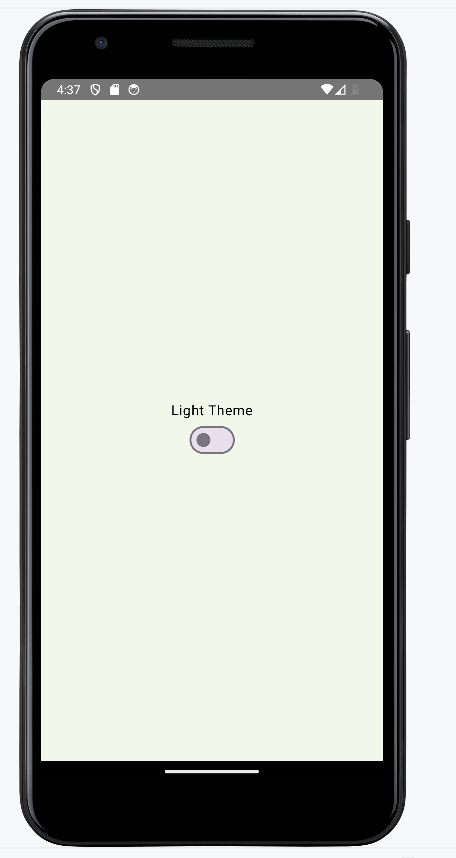
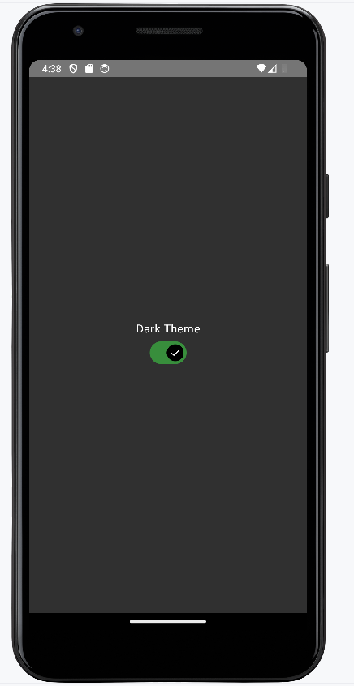

### Divider

```kotlin
package com.example.myapplication

import android.os.Bundle
import androidx.activity.ComponentActivity
import androidx.activity.compose.setContent
import androidx.compose.foundation.background
import androidx.compose.foundation.layout.*
import androidx.compose.foundation.layout.fillMaxHeight
import androidx.compose.foundation.layout.fillMaxWidth
import androidx.compose.foundation.layout.height
import androidx.compose.foundation.layout.width
import androidx.compose.material3.Text
import androidx.compose.runtime.Composable
import androidx.compose.ui.Modifier
import androidx.compose.ui.graphics.Color
import androidx.compose.ui.tooling.preview.Preview
import androidx.compose.ui.unit.Dp
import androidx.compose.ui.unit.dp
import com.example.myapplication.ui.theme.MyApplicationTheme

class MainActivity : ComponentActivity() {
    override fun onCreate(savedInstanceState: Bundle?) {
        super.onCreate(savedInstanceState)
        setContent {
            MyApplicationTheme {
                MyApp()
            }
        }
    }
}

@Composable
fun MyApp() {
    Column {
        HorizontalDividerExample()
        Spacer(modifier = Modifier.height(16.dp)) // Adding spacing
        VerticalDividerExample()
    }
}

@Composable
fun HorizontalDividerExample() {
    Column(
        verticalArrangement = androidx.compose.foundation.layout.Arrangement.spacedBy(8.dp),
    ) {
        Text("First item in list")
        HorizontalDivider(thickness = 2.dp)
        Text("Second item in list")
    }
}

@Composable
fun VerticalDividerExample() {
    Row(
        modifier = Modifier
            .fillMaxWidth()
            .height(IntrinsicSize.Min),
        horizontalArrangement = androidx.compose.foundation.layout.Arrangement.SpaceEvenly
    ) {
        Text("First item in row")
        VerticalDivider(color = Color.Gray) // Adjust color according to your theme
        Text("Second item in row")
    }
}

@Composable
fun HorizontalDivider(thickness: Dp, color: Color = Color.Gray) {
    Box(
        modifier = Modifier
            .fillMaxWidth()
            .height(thickness)
            .background(color)
    )
}

@Composable
fun VerticalDivider(thickness: Dp = 2.dp, color: Color = Color.Gray) {
    Box(
        modifier = Modifier
            .width(thickness)
            .fillMaxHeight()
            .background(color)
    )
}

@Preview(showBackground = true)
@Composable
fun DefaultPreview() {
    MyApplicationTheme {
        MyApp()
    }
}

```

### Output
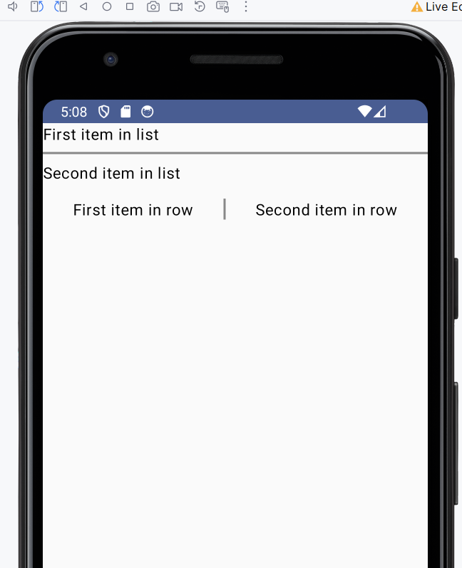

### Horizontal Loader

```kotlin
package com.example.myapplication

import android.app.Activity
import android.content.Intent
import android.os.Bundle
import androidx.activity.ComponentActivity
import androidx.activity.compose.setContent
import androidx.compose.animation.core.animateFloatAsState
import androidx.compose.foundation.layout.Arrangement
import androidx.compose.foundation.layout.Column
import androidx.compose.foundation.layout.fillMaxWidth
import androidx.compose.material3.Button
import androidx.compose.material3.LinearProgressIndicator
import androidx.compose.material3.Text
import androidx.compose.runtime.Composable
import androidx.compose.runtime.getValue
import androidx.compose.runtime.mutableStateOf
import androidx.compose.runtime.remember
import androidx.compose.runtime.rememberCoroutineScope
import androidx.compose.runtime.setValue
import androidx.compose.ui.Alignment
import androidx.compose.ui.Modifier
import androidx.compose.ui.unit.dp
import com.example.myapplication.ui.theme.MyApplicationTheme
import kotlinx.coroutines.delay
import kotlinx.coroutines.launch

class MainActivity : ComponentActivity() {
    override fun onCreate(savedInstanceState: Bundle?) {
        super.onCreate(savedInstanceState)
        setContent {
            MyApplicationTheme {
                LinearDeterminateIndicator()
            }
        }
    }
}

@Composable
fun LinearDeterminateIndicator() {
    var currentProgress by remember { mutableStateOf(0f) }
    var loading by remember { mutableStateOf(false) }
    val animatedProgress by animateFloatAsState(targetValue = currentProgress)
    val scope = rememberCoroutineScope() // Create a coroutine scope

    Column(
        verticalArrangement = Arrangement.spacedBy(12.dp),
        horizontalAlignment = Alignment.CenterHorizontally,
        modifier = Modifier.fillMaxWidth()
    ) {
        Button(onClick = {
            loading = true
            scope.launch {
                loadProgress { progress ->
                    currentProgress = progress
                }
                loading = false // Reset loading when the coroutine finishes
            }
        }, enabled = !loading) {
            Text("Start loading")
        }

        if (loading) {
            LinearProgressIndicator(
                progress = animatedProgress,
                modifier = Modifier.fillMaxWidth(),
            )
        }
    }
}

/** Iterate the progress value */
suspend fun loadProgress(updateProgress: (Float) -> Unit) {
    for (i in 1..100) {
        updateProgress(i.toFloat() / 100)
        delay(100)
    }
}
```

### Output
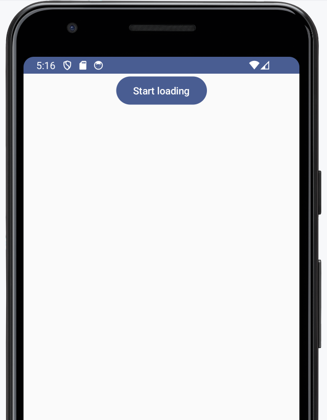
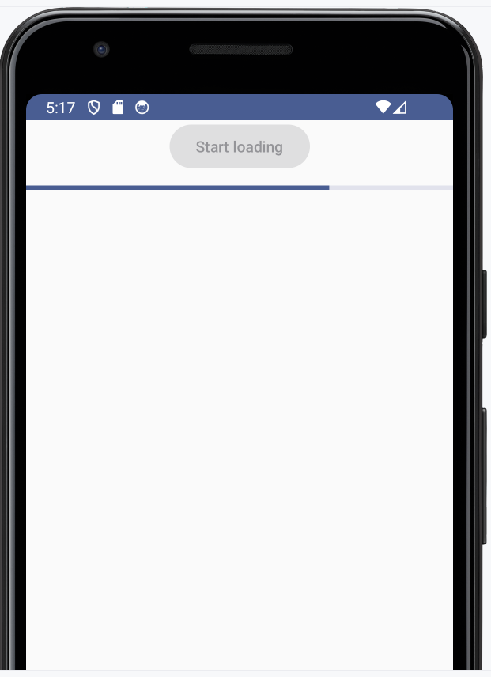


### Slider

```kotlin
package com.example.myapplication

import android.os.Bundle
import androidx.activity.ComponentActivity
import androidx.activity.compose.setContent
import androidx.compose.foundation.layout.Column
import androidx.compose.foundation.layout.fillMaxWidth
import androidx.compose.material3.Slider
import androidx.compose.material3.Text
import androidx.compose.runtime.Composable
import androidx.compose.runtime.getValue
import androidx.compose.runtime.mutableStateOf
import androidx.compose.runtime.remember
import androidx.compose.runtime.setValue
import androidx.compose.ui.Modifier
import androidx.compose.ui.tooling.preview.Preview

class MainActivity : ComponentActivity() {
    override fun onCreate(savedInstanceState: Bundle?) {
        super.onCreate(savedInstanceState)
        setContent {
            Column(
                modifier = Modifier.fillMaxWidth(),
            ) {
                SliderMinimalExample()
            }
        }
    }
}

@Preview
@Composable
fun SliderMinimalExample() {
    var sliderPosition by remember { mutableStateOf(0f) }
    Column(
        modifier = Modifier.fillMaxWidth(),
    ) {
        Slider(
            value = sliderPosition,
            onValueChange = { sliderPosition = it }
        )
        Text(text = "Slider Position: $sliderPosition")
    }
}
```

### Output
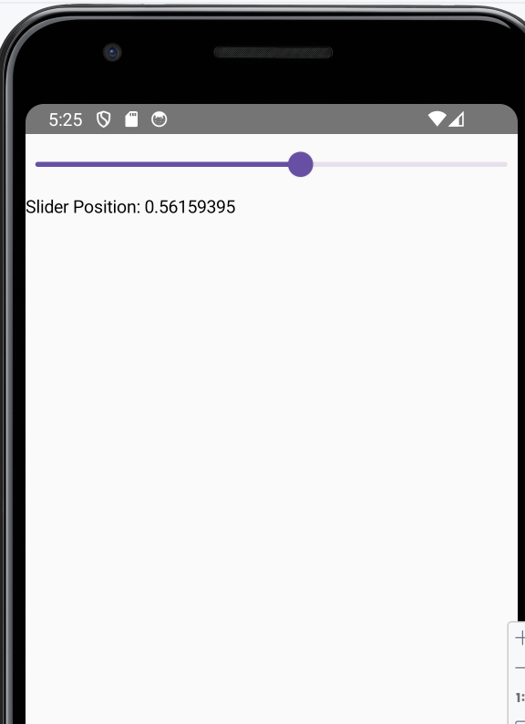

### Card

```kotlin
package com.example.myapplication

import android.os.Bundle
import androidx.activity.ComponentActivity
import androidx.activity.compose.setContent
import androidx.compose.foundation.layout.Arrangement
import androidx.compose.foundation.layout.Column
import androidx.compose.foundation.layout.fillMaxWidth
import androidx.compose.foundation.layout.height
import androidx.compose.foundation.layout.padding
import androidx.compose.material3.CardDefaults
import androidx.compose.material3.ElevatedCard
import androidx.compose.material3.Text
import androidx.compose.runtime.Composable
import androidx.compose.ui.Modifier
import androidx.compose.ui.text.style.TextAlign
import androidx.compose.ui.unit.dp

class MainActivity : ComponentActivity() {
    override fun onCreate(savedInstanceState: Bundle?) {
        super.onCreate(savedInstanceState)
        setContent {
            Column(
                modifier = Modifier.fillMaxWidth(),
            ) {
                CardColumn()
            }
        }
    }
}

@Composable
fun CardColumn() {
    Column(
        modifier = Modifier
            .fillMaxWidth()
            .padding(16.dp),
        verticalArrangement = Arrangement.spacedBy(16.dp)
    ) {
        ElevatedCardExample("Card 1", "This is the first card.")
        ElevatedCardExample("Card 2", "This is the second card.")
        ElevatedCardExample("Card 3", "This is the third card.")
    }
}

@Composable
fun ElevatedCardExample(title: String, text: String) {
    ElevatedCard(
        elevation = CardDefaults.cardElevation(
            defaultElevation = 6.dp
        ),
        modifier = Modifier
            .fillMaxWidth()
            .height(100.dp)
    ) {
        Text(
            text = title,
            modifier = Modifier
                .padding(16.dp),
            textAlign = TextAlign.Center,
        )
        Text(
            text = text,
            modifier = Modifier
                .padding(16.dp),
            textAlign = TextAlign.Center,
        )
    }
}
```

### Output
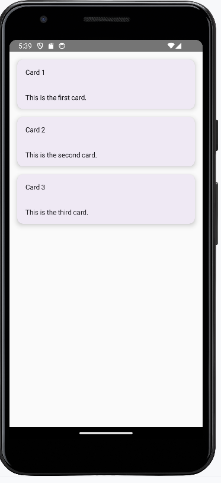

### Chip

```kotlin
package com.example.myapplication

import android.os.Bundle
import android.util.Log
import androidx.activity.ComponentActivity
import androidx.activity.compose.setContent
import androidx.compose.foundation.layout.Column
import androidx.compose.foundation.layout.fillMaxWidth
import androidx.compose.foundation.layout.size
import androidx.compose.material.icons.Icons
import androidx.compose.material.icons.filled.Close
import androidx.compose.material.icons.filled.Done
import androidx.compose.material.icons.filled.Person
import androidx.compose.material.icons.filled.Settings
import androidx.compose.material3.*
import androidx.compose.runtime.Composable
import androidx.compose.runtime.getValue
import androidx.compose.runtime.mutableStateOf
import androidx.compose.runtime.remember
import androidx.compose.runtime.setValue
import androidx.compose.ui.Modifier
import androidx.compose.ui.tooling.preview.Preview
import com.example.myapplication.ui.theme.MyApplicationTheme

class MainActivity : ComponentActivity() {
    override fun onCreate(savedInstanceState: Bundle?) {
        super.onCreate(savedInstanceState)
        setContent {
            MyApplicationTheme {
                MyApp()
            }
        }
    }
}

@Composable
fun MyApp() {
    Surface {
        MainPreview()
    }
}

@Composable
fun AssistChipExample() {
    AssistChip(
        onClick = { Log.d("Assist chip", "hello world") },
        label = { Text("Assist chip") },
        leadingIcon = {
            Icon(
                Icons.Filled.Settings,
                contentDescription = "Localized description",
                Modifier.size(AssistChipDefaults.IconSize)
            )
        }
    )
}

@OptIn(ExperimentalMaterial3Api::class)
@Composable
fun FilterChipExample() {
    var selected by remember { mutableStateOf(false) }

    FilterChip(
        onClick = { selected = !selected },
        label = {
            Text("Filter chip")
        },
        selected = selected,
        leadingIcon = if (selected) {
            {
                Icon(
                    imageVector = Icons.Filled.Done,
                    contentDescription = "Done icon",
                    modifier = Modifier.size(FilterChipDefaults.IconSize)
                )
            }
        } else {
            null
        },
    )
}

@OptIn(ExperimentalMaterial3Api::class)
@Composable
fun InputChipExample(
    text: String,
    onDismiss: () -> Unit,
) {
    var enabled by remember { mutableStateOf(true) }
    if (!enabled) return

    InputChip(
        onClick = {
            onDismiss()
            enabled = !enabled
        },
        label = { Text(text) },
        selected = enabled,
        avatar = {
            Icon(
                Icons.Filled.Person,
                contentDescription = "Localized description",
                Modifier.size(InputChipDefaults.AvatarSize)
            )
        },
        trailingIcon = {
            Icon(
                Icons.Default.Close,
                contentDescription = "Localized description",
                Modifier.size(InputChipDefaults.AvatarSize)
            )
        },
    )
}

@Composable
fun SuggestionChipExample() {
    SuggestionChip(
        onClick = { Log.d("Suggestion chip", "hello world") },
        label = { Text("Suggestion chip") }
    )
}

@Preview(showBackground = true)
@Composable
fun MainPreview() {
    Column(
        modifier = Modifier.fillMaxWidth(),
    ) {
        AssistChipExample()
        FilterChipExample()
        InputChipExample("Input chip", {})
        SuggestionChipExample()
    }
}

```

### Output
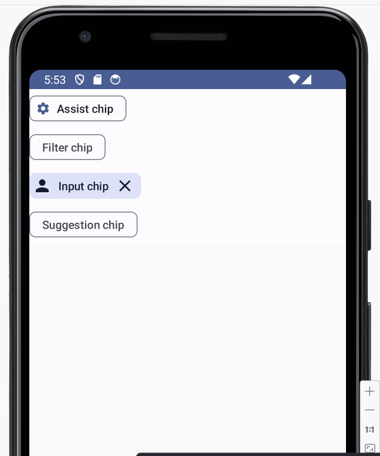

### Checkbox

```kotlin
package com.example.myapplication

import android.os.Bundle
import androidx.activity.ComponentActivity
import androidx.activity.compose.setContent
import androidx.compose.foundation.layout.Row
import androidx.compose.foundation.layout.fillMaxWidth
import androidx.compose.foundation.layout.padding
import androidx.compose.material3.Checkbox
import androidx.compose.material3.Text
import androidx.compose.runtime.Composable
import androidx.compose.runtime.getValue
import androidx.compose.runtime.mutableStateOf
import androidx.compose.runtime.remember
import androidx.compose.runtime.setValue
import androidx.compose.ui.Alignment
import androidx.compose.ui.Modifier
import androidx.compose.ui.unit.dp

class MainActivity : ComponentActivity() {
    override fun onCreate(savedInstanceState: Bundle?) {
        super.onCreate(savedInstanceState)
        setContent {
            CheckboxMinimalExample()
        }
    }
}

@Composable
fun CheckboxMinimalExample() {
    var checked by remember { mutableStateOf(true) }

    Row(
        modifier = Modifier
            .fillMaxWidth()
            .padding(16.dp),
        verticalAlignment = Alignment.CenterVertically,
    ) {
        Text(
            "Minimal checkbox"
        )
        Checkbox(
            checked = checked,
            onCheckedChange = { checked = it }
        )
    }

    Text(
        text = if (checked) "Checkbox is checked" else "Checkbox is unchecked",
        modifier = Modifier.padding(16.dp)
    )
}
```

### Output
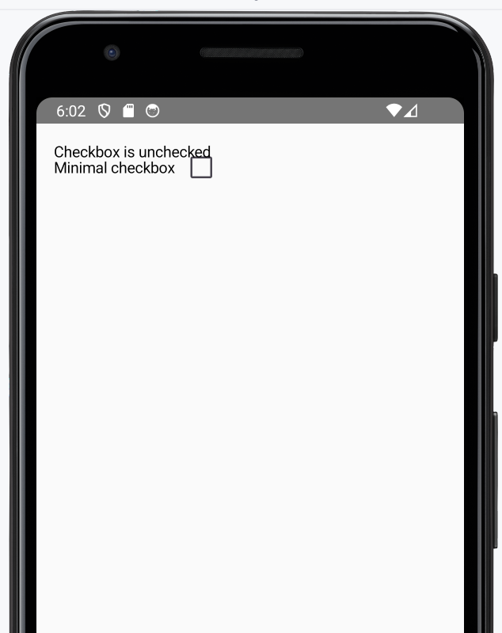
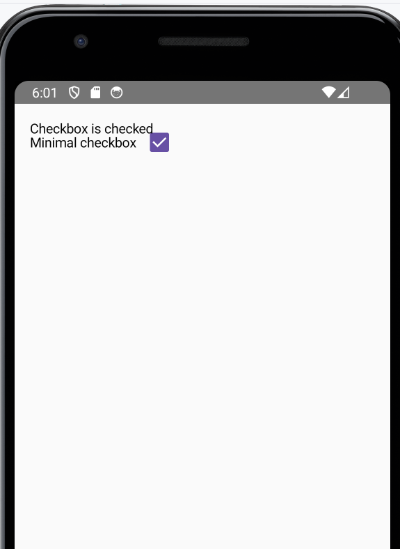


### TextField

```kotlin
package com.example.myapplication

import android.os.Bundle
import androidx.activity.ComponentActivity
import androidx.activity.compose.setContent
import androidx.compose.foundation.layout.fillMaxWidth
import androidx.compose.foundation.layout.padding
import androidx.compose.material3.OutlinedTextField
import androidx.compose.material3.Text
import androidx.compose.runtime.Composable
import androidx.compose.runtime.getValue
import androidx.compose.runtime.mutableStateOf
import androidx.compose.runtime.remember
import androidx.compose.runtime.setValue
import androidx.compose.ui.Modifier
import androidx.compose.ui.tooling.preview.Preview
import androidx.compose.ui.unit.dp
import com.example.myapplication.ui.theme.MyApplicationTheme

class MainActivity : ComponentActivity() {
    override fun onCreate(savedInstanceState: Bundle?) {
        super.onCreate(savedInstanceState)
        setContent {
            MyApplicationTheme {
                SimpleOutlinedTextFieldSample()
            }
        }
    }
}

@Composable
fun SimpleOutlinedTextFieldSample() {
    var text by remember { mutableStateOf("") }

    OutlinedTextField(
        value = text,
        onValueChange = { text = it },
        label = { Text("Name") },
        modifier = Modifier
            .fillMaxWidth()
            .padding(16.dp)
    )
}

@Preview(showBackground = true)
@Composable
fun DefaultPreview() {
    MyApplicationTheme {
        SimpleOutlinedTextFieldSample()
    }
}
```

### Output


### Grid

```kotlin
dependencies {
    implementation("com.google.accompanist:accompanist-flowlayout:0.25.1")
    implementation("io.coil-kt:coil-compose:2.2.2")
}
```

```kotlin
<?xml version="1.0" encoding="utf-8"?>
<manifest xmlns:android="http://schemas.android.com/apk/res/android"
    xmlns:tools="http://schemas.android.com/tools"
    package="com.example.myapplication">

    <!-- Required permission for internet access -->
    <uses-permission android:name="android.permission.INTERNET" />

    <application
        android:allowBackup="true"
        android:dataExtractionRules="@xml/data_extraction_rules"
        android:fullBackupContent="@xml/backup_rules"
        android:icon="@mipmap/ic_launcher"
        android:label="@string/app_name"
        android:roundIcon="@mipmap/ic_launcher_round"
        android:supportsRtl="true"
        android:theme="@style/Theme.MyApplication"
        tools:targetApi="31">

        <activity
            android:name=".MainActivity"
            android:exported="true"
            android:label="@string/app_name"
            android:theme="@style/Theme.MyApplication">
            <intent-filter>
                <action android:name="android.intent.action.MAIN" />
                <category android:name="android.intent.category.LAUNCHER" />
            </intent-filter>
        </activity>
    </application>

</manifest>

```

```kotlin
package com.example.myapplication

import android.os.Bundle
import androidx.activity.ComponentActivity
import androidx.activity.compose.setContent
import androidx.compose.foundation.layout.Arrangement
import androidx.compose.foundation.layout.fillMaxSize
import androidx.compose.foundation.layout.fillMaxWidth
import androidx.compose.foundation.layout.wrapContentHeight
import androidx.compose.foundation.lazy.staggeredgrid.LazyVerticalStaggeredGrid
import androidx.compose.foundation.lazy.staggeredgrid.StaggeredGridCells
import androidx.compose.material3.MaterialTheme
import androidx.compose.runtime.Composable
import androidx.compose.ui.Modifier
import androidx.compose.ui.layout.ContentScale
import androidx.compose.ui.unit.dp
import coil.compose.AsyncImage
import com.example.myapplication.ui.theme.MyApplicationTheme

class MainActivity : ComponentActivity() {
    override fun onCreate(savedInstanceState: Bundle?) {
        super.onCreate(savedInstanceState)
        setContent {
            MyApplicationTheme {
                StaggeredGridScreen()
            }
        }
    }
}

@Composable
fun StaggeredGridScreen() {
    val randomSizedPhotos = listOf(
        "https://i.pinimg.com/564x/26/01/c4/2601c4d273d8a2098f343499cdb32f44.jpg",
        "https://i.pinimg.com/236x/2c/18/c4/2c18c4574f8642a83b361c394b339112.jpg",
        "https://i.pinimg.com/564x/dc/01/ce/dc01ce6b351f5525931d9c4f99a80658.jpg",
        "https://i.pinimg.com/564x/a3/4f/fb/a34ffb176641c47c65afaa2e89e209a5.jpg",
        "https://i.pinimg.com/564x/26/01/c4/2601c4d273d8a2098f343499cdb32f44.jpg",
        "https://i.pinimg.com/236x/2c/18/c4/2c18c4574f8642a83b361c394b339112.jpg",
        "https://i.pinimg.com/564x/dc/01/ce/dc01ce6b351f5525931d9c4f99a80658.jpg",
        "https://i.pinimg.com/564x/a3/4f/fb/a34ffb176641c47c65afaa2e89e209a5.jpg",
        "https://i.pinimg.com/564x/26/01/c4/2601c4d273d8a2098f343499cdb32f44.jpg",
        "https://i.pinimg.com/236x/2c/18/c4/2c18c4574f8642a83b361c394b339112.jpg",
        "https://i.pinimg.com/564x/dc/01/ce/dc01ce6b351f5525931d9c4f99a80658.jpg",
        "https://i.pinimg.com/564x/a3/4f/fb/a34ffb176641c47c65afaa2e89e209a5.jpg"
    
    )

    LazyVerticalStaggeredGrid(
        columns = StaggeredGridCells.Fixed(2), 
        verticalItemSpacing = 4.dp,
        horizontalArrangement = Arrangement.spacedBy(4.dp),
        modifier = Modifier.fillMaxSize()
    ) {
        items(randomSizedPhotos.size) { index ->
            val photo = randomSizedPhotos[index]
            AsyncImage(
                model = photo,
                contentDescription = null,
                contentScale = ContentScale.Crop,
                modifier = Modifier
                    .fillMaxWidth()
                    .wrapContentHeight()
            )
        }
    }
}

```

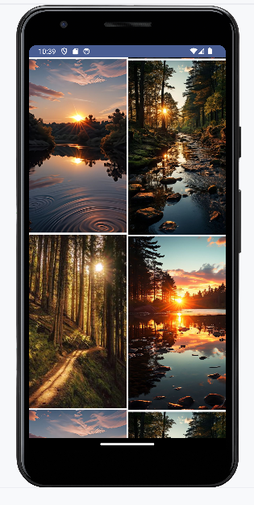

### Navigation

```kotlin
dependencies {
    val nav_version = "2.7.7"

    implementation("androidx.navigation:navigation-compose:$nav_version")
}
```

### Shopping navigation

```kotlin
package com.example.myapplication

import android.os.Bundle
import androidx.activity.ComponentActivity
import androidx.activity.compose.setContent
import androidx.compose.foundation.layout.*
import androidx.compose.foundation.lazy.LazyColumn
import androidx.compose.foundation.lazy.items
import androidx.compose.material3.Button
import androidx.compose.material3.Text
import androidx.compose.runtime.Composable
import androidx.compose.ui.Modifier
import androidx.compose.ui.unit.dp
import androidx.navigation.NavController
import androidx.navigation.compose.NavHost
import androidx.navigation.compose.composable
import androidx.navigation.compose.rememberNavController
import com.example.myapplication.ui.theme.MyApplicationTheme

class MainActivity : ComponentActivity() {
    override fun onCreate(savedInstanceState: Bundle?) {
        super.onCreate(savedInstanceState)
        setContent {
            MyApplicationTheme {
                AppNavigation()
            }
        }
    }
}

@Composable
fun ProductListScreen(navController: NavController) {
    Column(
        modifier = Modifier
            .fillMaxSize()
            .padding(16.dp)
    ) {
        Text("Welcome to our Online Store!")
        Spacer(modifier = Modifier.height(16.dp))
        Button(onClick = {
            navController.navigate("productListDetails") // Navigate to Product List Details
        }) {
            Text("Check Products")
        }
    }
}

@Composable
fun ProductListDetailsScreen(navController: NavController) {
    val productList = listOf("Product 1", "Product 2", "Product 3", "Product 4", "Product 5")

    LazyColumn(
        modifier = Modifier
            .fillMaxSize()
            .padding(16.dp)
    ) {
        items(productList) { product ->
            ProductCard(product = product, onClick = {
                navController.navigate("productDetail/$product") // Navigate to Product Detail
            })
        }
    }
}

@Composable
fun ProductDetailScreen(navController: NavController, productId: String) {
    Column(
        modifier = Modifier
            .fillMaxSize()
            .padding(16.dp)
    ) {
        Text("Product Details for: $productId")
        Spacer(modifier = Modifier.height(16.dp))
        Button(onClick = {
            navController.navigate("cart") // Navigate to Cart
        }) {
            Text("Add to Cart")
        }
    }
}

@Composable
fun CartScreen(navController: NavController) {
    Column(
        modifier = Modifier
            .fillMaxSize()
            .padding(16.dp)
    ) {
        Text("Your Cart")
        Spacer(modifier = Modifier.height(16.dp))
        Button(onClick = {
            navController.navigate("checkout") // Navigate to Checkout
        }) {
            Text("Proceed to Checkout")
        }
        Spacer(modifier = Modifier.height(16.dp))
        Button(onClick = {
            navController.popBackStack("productListDetails", false) // Go back to Product List Details
        }) {
            Text("Continue Shopping")
        }
    }
}

@Composable
fun CheckoutScreen(navController: NavController) {
    Column(
        modifier = Modifier
            .fillMaxSize()
            .padding(16.dp)
    ) {
        Text("Checkout")
        Spacer(modifier = Modifier.height(16.dp))
        Button(onClick = {
            navController.popBackStack("productList", false) // Go back to Product List
        }) {
            Text("Back to Shopping")
        }
    }
}

@Composable
fun AppNavigation() {
    val navController = rememberNavController()
    NavHost(navController = navController, startDestination = "productList") {
        composable("productList") {
            ProductListScreen(navController)
        }
        composable("productListDetails") {
            ProductListDetailsScreen(navController)
        }
        composable("productDetail/{productId}") { backStackEntry ->
            val productId = backStackEntry.arguments?.getString("productId") ?: ""
            ProductDetailScreen(navController, productId)
        }
        composable("cart") {
            CartScreen(navController)
        }
        composable("checkout") {
            CheckoutScreen(navController)
        }
    }
}

@Composable
fun ProductCard(product: String, onClick: () -> Unit) {
    Button(
        onClick = onClick,
        modifier = Modifier
            .fillMaxWidth()
            .padding(vertical = 8.dp)
    ) {
        Text(text = product)
    }
}

```

### Output
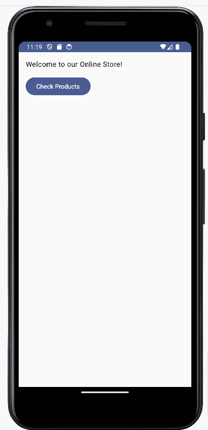
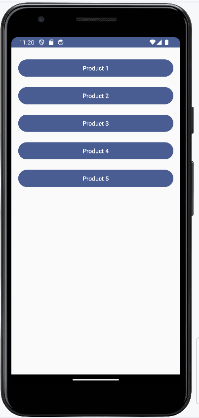
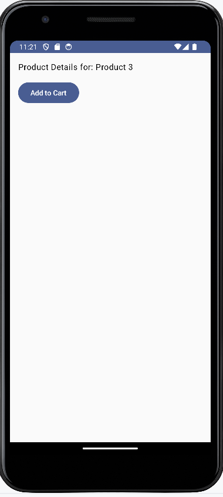
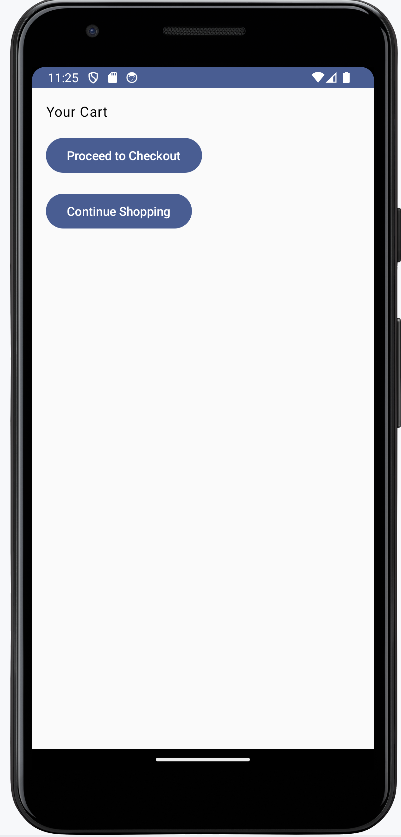
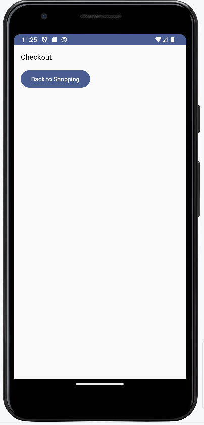

### Basic MVVM implementation

```kotlin
//MainActivity.kt

package com.example.myapplication

import android.os.Bundle
import androidx.activity.ComponentActivity
import androidx.activity.compose.setContent

class MainActivity : ComponentActivity() {
    override fun onCreate(savedInstanceState: Bundle?) {
        super.onCreate(savedInstanceState)
        setContent {
            TaskListScreen()
        }
    }
}

```

```kotlin
// Task.kt

package com.example.myapplication

data class Task(
    val id: Long,
    val title: String,
    val description: String
)

```

```kotlin
// TaskViewModel.kt

package com.example.myapplication

import androidx.compose.runtime.mutableStateListOf
import androidx.compose.runtime.mutableStateOf
import androidx.lifecycle.ViewModel

class TaskViewModel : ViewModel() {

    // Simulated data source
    private val tasks = mutableStateListOf(
        Task(1, "Task 1", "Description for Task 1"),
        Task(2, "Task 2", "Description for Task 2"),
        Task(3, "Task 3", "Description for Task 3")
    )

    // Expose the tasks as immutable State
    fun getTasks(): List<Task> {
        return tasks
    }

    // Function to add a new task
    fun addTask(task: Task) {
        tasks.add(task)
    }
}

```

```kotlin
// TaskListScreen.kt

package com.example.myapplication

import androidx.compose.foundation.layout.Column
import androidx.compose.foundation.lazy.LazyColumn
import androidx.compose.foundation.lazy.items
import androidx.compose.material3.Text
import androidx.compose.runtime.Composable
import androidx.lifecycle.viewmodel.compose.viewModel

@Composable
fun TaskListScreen(viewModel: TaskViewModel = viewModel()) {
    val tasks = viewModel.getTasks()

    Column {
        Text(text = "Task List")

        LazyColumn {
            items(tasks) { task ->
                TaskListItem(task = task)
            }
        }
    }
}

@Composable
fun TaskListItem(task: Task) {
    Text(text = "${task.title}: ${task.description}")
}

```

### OUTPUT
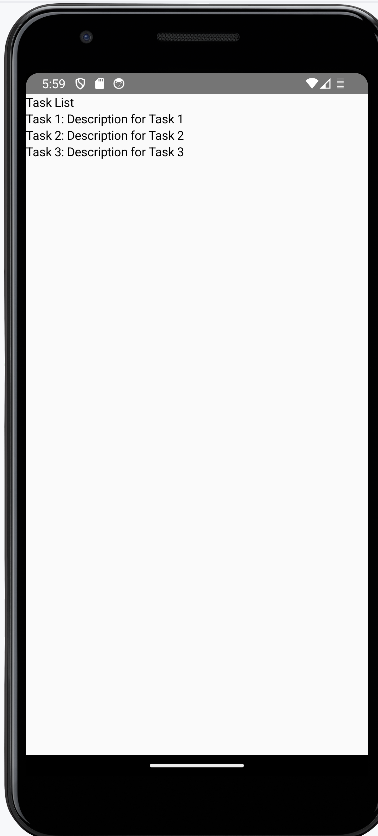

### Generic example

```kotlin
package com.example.myapplication

class Student<T> (text : T){
    var x = text
    init{
        println(x)
    }
}
fun main(args: Array<String>){
    var name: Student<String> = Student<String>("Swati")
    var age: Student<Int> = Student<Int>(21)
}

```

### OUTPUT


### UI replication

```kotlin
package com.example.myapplication

import android.os.Bundle
import androidx.activity.ComponentActivity
import androidx.activity.compose.setContent
import androidx.compose.foundation.Image
import androidx.compose.foundation.background
import androidx.compose.foundation.clickable
import androidx.compose.foundation.layout.*
import androidx.compose.material3.MaterialTheme
import androidx.compose.material3.OutlinedTextField
import androidx.compose.material3.Text
import androidx.compose.material3.Button
import androidx.compose.material3.Surface
import androidx.compose.runtime.Composable
import androidx.compose.ui.Alignment
import androidx.compose.ui.Modifier
import androidx.compose.ui.graphics.Color
import androidx.compose.ui.res.painterResource
import androidx.compose.ui.text.font.FontWeight
import androidx.compose.ui.unit.dp
import androidx.compose.ui.unit.sp
import com.example.myapplication.ui.theme.MyApplicationTheme

class MainActivity : ComponentActivity() {
    override fun onCreate(savedInstanceState: Bundle?) {
        super.onCreate(savedInstanceState)
        setContent {
            MyApplicationTheme {
                Surface(
                    modifier = Modifier.fillMaxSize(),
                    color = MaterialTheme.colorScheme.background
                ) {
                    MainScreen()
                }
            }
        }
    }
}

@Composable
fun MainScreen() {
    Column(
        modifier = Modifier
            .fillMaxSize()
            .padding(16.dp)
    ) {
        Column(
            modifier = Modifier
                .fillMaxWidth()
                .weight(1f)
                .background(Color(0xFFEFF4FA))
                .padding(16.dp,)
        ) {
            Text(
                text = "Jetpack Compose",
                fontSize = 20.sp,
                fontWeight = FontWeight.Medium,
                color = Color(0xFF1B5F8C),
                modifier = Modifier
                    .weight(1f)
                    .padding(horizontal=8.dp,vertical=0.dp)
                    .align(Alignment.CenterHorizontally)
            )
            Box(
                modifier = Modifier
                    .align(Alignment.CenterHorizontally)
                    .padding(0.dp)
            ) {
                Image(
                    painter = painterResource(id = R.drawable.jetpack_logo),
                    contentDescription = "jetpack logo",
                    modifier = Modifier
                        .padding(0.dp) // Padding for the Image inside the Box
                )
            }
            Text(
                text = "Login",
                fontSize = 24.sp,
                color = Color(0xFF006134),
                modifier = Modifier
                    .padding(vertical = 8.dp)
                    .padding(8.dp)
            )
            OutlinedTextField(
                value = "",
                onValueChange = { /*TODO*/ },
                label = { Text("Email ID or Mobile Number") },
                modifier = Modifier
                    .fillMaxWidth()
                    .padding(vertical = 8.dp)
                    .padding(8.dp)
            )
            OutlinedTextField(
                value = "",
                onValueChange = { /*TODO*/ },
                label = { Text("Password") },
                modifier = Modifier
                    .fillMaxWidth()
                    .padding(vertical = 8.dp)
                    .padding(8.dp)
            )
            Text(
                text = "Forgot Password ?",
                fontSize = 10.sp,
                color = Color(0xFF185E4B),
                modifier = Modifier
                    .clickable { /* TODO: Implement Forgot Password action */ }
                    .padding(8.dp)
                    .padding(8.dp)
                    .align(Alignment.End) // Align to the right
            )
            Button(
                onClick = { /* TODO: Implement Login action */ },
                modifier = Modifier.fillMaxWidth()
                    .padding(8.dp)
            ) {
                Text(
                    text = "Login",
                    fontSize = 12.sp,
                    fontWeight = FontWeight.Medium,
                    color = Color.White
                )
            }
        }
        Text(
            text = "Dont have an account? Register",
            fontSize = 10.sp,
            fontWeight = FontWeight.Medium,
            modifier = Modifier
                .align(Alignment.CenterHorizontally)
                .padding(vertical = 16.dp)
                .padding(8.dp)
        )
    }
}

```

### OUTPUT

